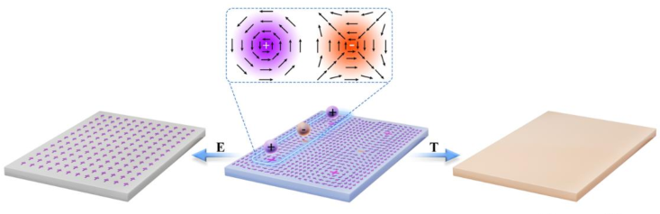
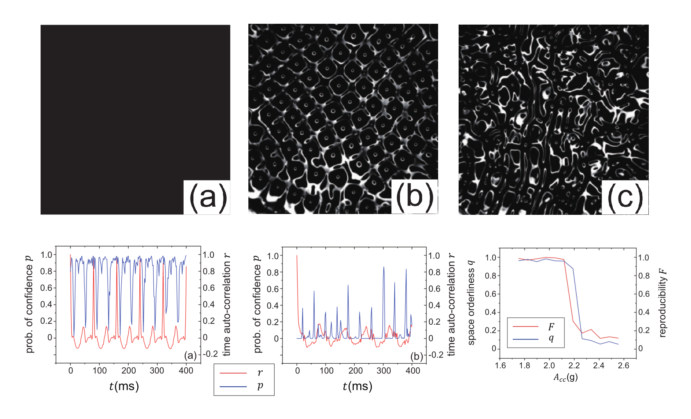

Hi! I am Tiancheng Yu (俞天成, pronounced as Tea-en-chung Yoo). I'm a fourth year undergraduate student from [School of Physics](https://phy.pku.edu.cn/), [Peking University](https://www.pku.edu.cn/). My research interest includes structure and physical properties of new energy materials and 4D-STEM.

I am very fortunate to be advised by [Prof. XXX](https://www.XXX.com/) of XXX Lab from [School of XXX](https://phy.pku.edu.cn/), XXX University. I was advised by [Prof. PengGao](https://scholar.google.com/citations?hl=en&user=JQLol_0AAAAJ) of International Center for Quantum Materials from [School of Physics](https://phy.pku.edu.cn/), Peking University.

You can find my CV here: [Tiancheng Yu's Curriculum Vitae](../assets/Curriculum_Vitae.pdf).

[Email](mailto:2000011321@stu.pku.edu.cn) / [Github](https://github.com/TianchengYu2001)

Preprints
======

Ruixue Zhu=, Sizheng Zheng=, Xiaomei Li=, Tao Wang=, Congbing Tan&#42;, Tiancheng Yu, 
Zhetong Liu, Xinqiang Wang, Jiangyu Li&#42;, Jie Wang&#42;, Peng Gao&#42;, 
<i>Atomic-Scale Tracking Phase Transition Dynamics of Berezinskii-Kosterlitz-Thouless Polar Vortex-Antivortex</i>, **arXiv** 2308.07583 (2023). 
[weblink](https://arxiv.org/abs/2308.07583)

Peizhao Li=, Tiancheng Yu=, Xuechang Tu, Han Yan, Wei Wang, Luqun Zhou&#42;, <i>Experiments on Phase Transition of Faraday Waves with Xantham Gum Solutions</i>,
**arXiv** 2305.06690 (2023). 
[weblink](https://www.researchgate.net/publication/373411670_Experiments_on_Phase_Transition_of_Faraday_Waves_with_Xantham_Gum_Solutions)

Honors and Awards
======
 **•** ? Scholarship
Sept 2023

 **•** Peking University “Merit Student Pacesetter” Award
Sept 2023

 **•** Peking University Challenge Cup Excellence Award
June 2023

 **•** School of Physics Weiming Scholarship
June 2022 & Sept 2023

 **•** Peking University Academic Excellence Award
Sept 2021

 **•** School of Physics Shen Keqi Scholarship
Sept 2021

 **•** Silver Medal in the 36th China Physics Olympics final
Hangzhou, China, Nov 2019

