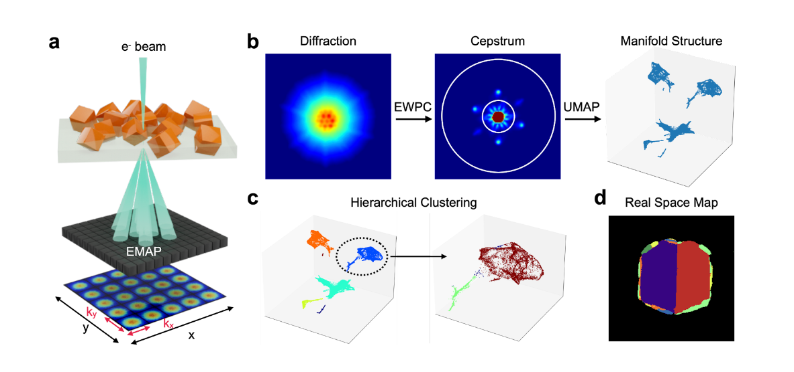

Hi! I am Tiancheng Yu (俞天成, pronounced as Tea-en-chung Yoo). I am an undergraduate student majoring in [Physics](https://phy.pku.edu.cn/) at [Peking University](https://www.pku.edu.cn/). 

During my undergraduate, I am grateful to be advised by [Prof. Peng Gao](https://scholar.google.com/citations?hl=en&user=JQLol_0AAAAJ) at [International Center for Quantum Materials(ICQM)](http://icqm.pku.edu.cn/gyzx/gyzx_gyzx/index.htm), Peking University. Currently I am also a visiting research student at [School of Engineering and Applied Science(SEAS)](https://seas.harvard.edu/), Harvard University, supervised by [Prof. Xin Li](https://scholar.harvard.edu/lixin).

My research interest includes electrode materials, grain boundaries in 2D materials and 4D-STEM.

[Email](mailto:tianchengyu@fas.harvard.edu) / [Github](https://github.com/TianchengYu2001)

Preprints
======

Advancing Nanobeam 4D-STEM Through Manifold Learning in Cepstrum Space
-----
Chuqiao Shi=, Tiancheng Yu=, Aaron Bayles, Zhihua Cheng, Matthew R. Jones, Naomi Halas, Yimo Han&#42;. [weblink]()

    
    

        Nanobeam 4D-STEM is a powerful tool for studying nanomaterial crystal structures. Unsupervised machine learning is used to analyze large, unlabeled 4D-STEM datasets by finding patterns in diffractions. However, noise from unrelated features like lattice mistilt and dynamic scattering can disrupt machine learning models. This paper explores a new method using cepstrum transformation and manifold learning to extract meaningful lattice features like strain, orientation, and domain structures. This enhances machine learning accuracy. Our techniques are validated using diverse materials, including 2D ferroelectric materials and nanoparticles. These methods promise efficient characterization of nanostructures in 4D-STEM workflows.
    

Atomic-Scale Tracking Phase Transition Dynamics of BKT Polar Vortex-Antivortex
-----
Ruixue Zhu=, Sizheng Zheng=, Xiaomei Li=, Tao Wang=, Congbing Tan&#42;, Tiancheng Yu, Zhetong Liu, Xinqiang Wang, Jiangyu Li&#42;, Jie Wang&#42;, Peng Gao&#42;, **arXiv** 2308.07583 (2023). [weblink](https://arxiv.org/abs/2308.07583)

Experiments on Phase Transition of Faraday Waves with Xantham Gum Solutions
-----
Peizhao Li=, Tiancheng Yu=, Xuechang Tu, Han Yan, Wei Wang, Luqun Zhou&#42;, **arXiv** 2305.06690 (2023). [weblink](https://www.researchgate.net/publication/373411670_Experiments_on_Phase_Transition_of_Faraday_Waves_with_Xantham_Gum_Solutions)

Honors and Awards
======

 **•** Outstanding Individual Performance Evaluation
Oct 2023

 **•** Lingjun Advanced Scholarship
Sept 2023

 **•** Peking University “Merit Student” Award
Sept 2023

 **•** Peking University Challenge Cup Excellence Award
June 2023

 **•** China Undergraduate Physics Experiment Competition(CUPEC) Innovation Award
Dec 2022

 **•** School of Physics Weiming Scholarship
June 2022 & Sept 2023

 **•** Peking University Academic Excellence Award
Sept 2021

 **•** School of Physics Shen Keqi Scholarship
Sept 2021

 **•** Zhu Kezhen Gold Award
Sept 2020

 **•** Silver Medal in 36th Chinese Physics Olympics Final
Hangzhou, China, Nov 2019

 **•** First Prize in 36th Chinese Physics Olympics in Provinces
Hangzhou, China, Sept 2019

