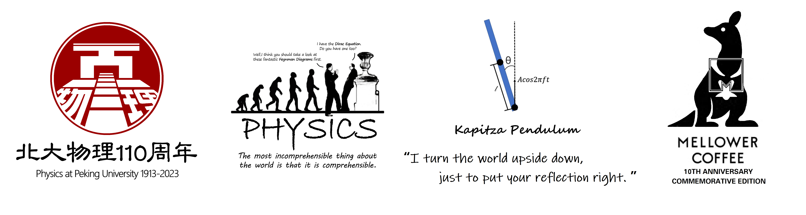



 **• Volunteer Member** 
<i>Three Bodies</i> Creative Team's Visit to Peking University, <i>March 2023</i>. 
Peking University Winter Break Returning to Hometown Promotion, <i>Jan 2023</i>. 
Zhejiang Provincial Division of the Peking University Admissions Office, <i>June 2022</i>.

 **• Billiards Team Member**, Peking University School of Physics Billiards Team, <i>Oct 2020 - April 2023</i>. 
PKU Cup Billiards Championship 
Champion (First Team) and Round of Sixteen (Second Team), 2021. 
Octo-finalist (First Team) and Round of Sixteen (Second Team), 2022. 
 **• Publicity Department Officer**, Peking University Billiards Association, <i>Sept 2021 - March 2022</i>.

 **•** Peking University Hundred-Kilometer Relay Race Competition 
Team 7th Place (2021), Team 4th Place (2022), Team 10th Place (2023).

 **•** Logo Design 
Physics at Peking University 110th Anniversary Logo. 
Peking University, School of Physics 2021 Yard Shirt Logo. 
National College Student Physics Experiment Competition (Innovation Group) Group Logo. 
Peking University Mellower Coffee 10th Anniversary Logo.

