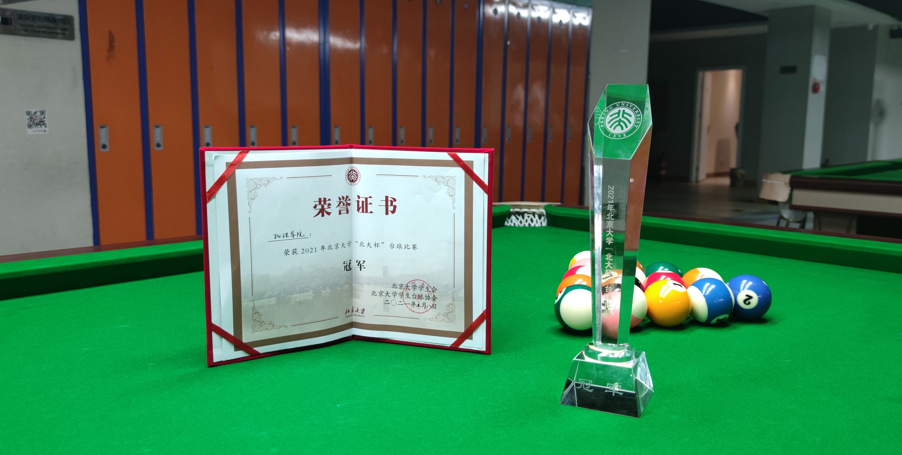



 **• Volunteer Member** 
Peking University Alumni Salon with Microsoft Greater China CEO June 2023 
Peking University Music Conservatory 100th Anniversary Concert May 2023 
<i>Three Bodies</i> Creative Team's Visit to Peking University March 2023 
Peking University Winter Break Returning to Hometown Promotion Jan 2023 
Zhejiang Provincial Division of the Peking University Admissions Office June 2022 
PKUPOA 4th City Orienteering Event May 2022 
Peking University Winter Sports Meeting Opening Ceremony Jan 2022 
Peking University Youth Astronomy Association Meteor Shower Observation Event Dec 2021 
Peking University Youth Astronomy Association Jupiter, Mars, and Uranus Observation Event Sept 2021 
Peking University Book Relay Event Sept 2020 & Sept 2021 & Sept 2022

 **• Billiards Team Member**
Peking University School of Physics Billiards Team, <i>Oct 2020 - April 2023</i>. 
PKU Cup Billiards Championship： 
Octo-finalist (First Team) and Round of Sixteen (Second Team), <i>2022</i>. 
Champion (First Team) and Round of Sixteen (Second Team), <i>2021</i>. 
 **• Publicity Department Officer**, Peking University Billiards Association, <i>Sept 2021 - March 2022</i>.
 

 **• Sports**
 **•** Peking University Hundred-Kilometer Relay Race Competition 
Team 9th Place (<i>2023</i>), Team 4th Place (<i>2022</i>), Team 7th Place (<i>2021</i>). 
 **•** Peking University May Fourth Youth Long-distance Race, <i>2021</i>. 
 **•** Peking University Freshman Cup 3V3 Basketball Tournament, <i>2020</i>.

 **• Culture and Art**
 **•** Outstanding Participant in <i>2021</i> USTC Excellent College Student Summer Camp Physics Program. 
 **•** China Nuclear Power Engineering Corporation 404 Practical Activity, Outstanding Achievement Award in <i>2021</i> Practice Activities by Peking University, School of Physics. 
 **•** 2020-2021 Peking University Advanced Class, Outstanding Youth League Branch. 
 **•** Safe and Civilized Dormitories (<i>2020</i>, <i>2021</i>, <i>2023</i>). 
 **•** Peking University 12.9 Choral Event, <i>2020</i>.
 
 **• Logo Design **
Physics at Peking University 110th Anniversary Logo. 
Peking University, School of Physics <i>2021</i> Shirt Logo. 
National College Student Physics Experiment Competition (Innovation Group) Group Logo. 
Peking University Mellower Coffee 10th Anniversary Logo.

 **• Sketches **
 
